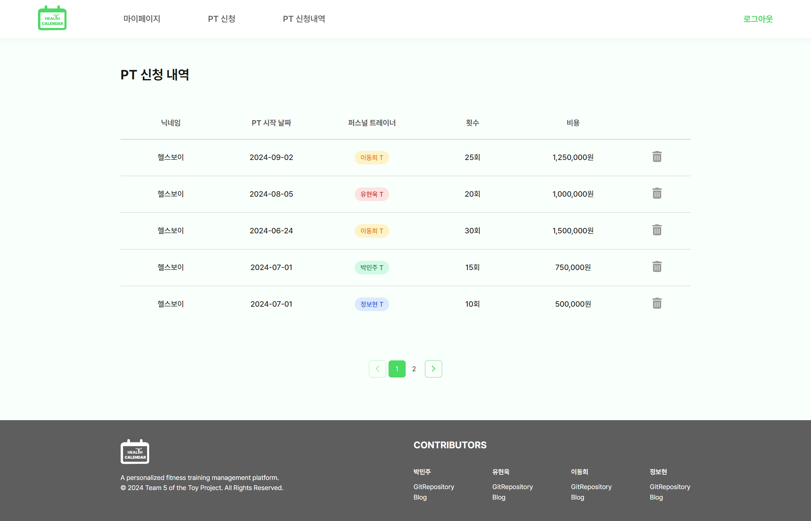

# 💪 헬스 캘린더

<div>
  <a href="" target="_blank">
    
  </a>
</div>

#### 테스트 계정

```
ID : dev@email.com
PW : 12345678
```

<br>

## 프로젝트 소개

개인 운동 정보를 기록하고 관리할 수 있는 플랫폼을 제작했습니다.<br>
캘린더를 통해 PT 수업 받은 내용을 기록할 수 있습니다. 개인 트레이닝 수업을 신청하고, 신청한 내역과 개인 정보 및 신체 정보를 확인할 수 있습니다.

- 개발 기간 : 2024.05.27 ~ 2024.06.08
- [GitHub 레포지토리](https://github.com/Toy2Team/toy2)
- [피그마 URL](https://www.figma.com/design/7lEvIfutwvA9yO1EfXj5Kq/%ED%86%A0%EC%9D%B4%ED%94%84%EB%A1%9C%EC%A0%9D%ED%8A%B82_%ED%97%AC%EC%8A%A4%EC%BA%98%EB%A6%B0%EB%8D%94?m=dev&node-id=65-422&t=tar3EgTOtHJbRak2-1)

<br>

## 팀원 소개 및 역할

|                     |  |  |  |
| :-------------------------------------------------------------------------------------------------: | :-------------------------------------------------------------------------------: | :------------------------------------------------------------------------------: | :-------------------------------------------------------------------------------: |
|                               [박민주](https://github.com/minnug-dev)                               |                     [유현욱](https://github.com/YuHyeonWook)                      |                       [이동희](https://github.com/ldh9669)                       |                    [정보현](https://github.com/jeongbohyeoun)                     |
| 전체 디자인<br>로딩 페이지<br>PT신청 & 신청 내역 페이지<br> 공통 컴포넌트(Button, Input)<br> 반응형 |      초기 개발 세팅</br>로그인 회원가입 기능구현</br> 마이페이지 프로필 구현      |                                        3                                         |          캘린더 페이지<br>일정 추가,삭제,수정 기능구현 |

<br>

## 사용한 기술 스택

|            | Stack                                                                                                                                                                                                                                                                                                                                      |
| :--------: | ------------------------------------------------------------------------------------------------------------------------------------------------------------------------------------------------------------------------------------------------------------------------------------------------------------------------------------------ |
| 개발 환경  |                                                                                                                                        |
|  유틸리티  |                |
|   디자인   |                                                                                                                                                                                                                                        |
| 개발 언어  |                                                                                                                                                                                                                              |
| 라이브러리 |    |
|    서버    |                                                                                                                                                                                                                                  |
|    배포    |                                                                                                                                                                                                                                     |
|   협업툴   |                                                                                                                                      |

<br>

## 구현 사항

### 로그인 & 회원가입


- firebase를 이용해서 로그인, 회원가입 기능 구현
- 유효성 검사 기능 구현

---

### 마이페이지


- Firebase의 realtime, storage를 이용하여 이미지 업로드 및 이메일, 닉네임, 생년월일, 전화번호 기능 구현함
- 유저 닉네임 data를 zustand를 활용하여 신청 내역에 보이도록 구현 및 로컬스토리지에 저장함

---

### 캘린더

- Firebase 의 realtime database 를 이용하여 일정 추가, 삭제, 수정 기능 구현함
- Firebase 의 인증 객체를 활용하여 로그인 시 자신의 데이터만 볼 수 있게 구현함 
- 일정의 시작 날짜가 종료 날짜보다 늦을 경우, 일정 추가와 수정 불가능하게 구현함
  
---

### PT 신청 관리


#### PT 신청

- Firebase 데이터베이스 및 인증 객체를 활용하여 로그인 시 현재 인증된 사용자 ID로 구분되어 특정 사용자 데이터 관리
- useState 훅 사용하여 신청 내용(날짜, 트레이너, 횟수, 비용) 상태 관리
- 원하는 횟수를 선택 시 해당 비용 자동적으로 업데이트
  <br><br><br>



#### PT 신청 내역

- 사용자 ID가 변경될 때마다 Firebase 데이터베이스에서 신청 내역 데이터 관리
- 트레이너 이름에 따라 색상을 설정하는 함수를 사용하여 사용자의 직관성 높임
- 해당 내역이 5개 초과 시 페이지네이션 기능 구현
